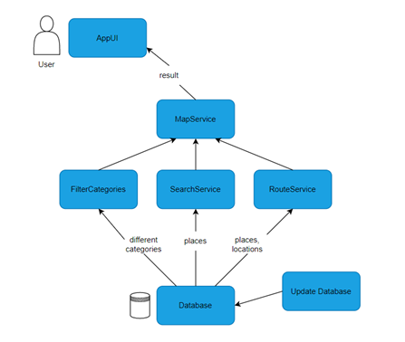

# Архитектурни погледи
## Концептуален поглед

Explore_It е веб апликација која им овозможува на корисниците да пребаруваат низ мапа на Северна Македонија и да бараат различни места од интерес. Концептуалниот поглед се состои од некои компоненти кои го опишуваат главниот изглед на апликацијата (front-end) и позадинската логика (back-end). Воглавно преку овој поглед се опишува главниот начин на функционирање на апликацијата и нејзините доменски одговорности.  
Како рамка за управување со корисничката страна ја користиме React библиотеката, додека пак за управување со позадинската логика, ја користиме рамката Java Spring Boot, преку која ги имплементираме серверската страна и сервисните услуги. Со помош на RESTful API комуницираме со веб апликацијата. Серверот користи податоци од Open Street Map API за да ја пополни базата со соодветните податоци. Ја користиме базата на податоци PostgreSQL, преку која соодветно имаме пристап до податоците. 
#### Клучни концепти
Функциски барања:
-	Апликацијата треба да ја **прикажува мапата** на Република Македонија.
-	Апликацијата треба да **постави маркери** на **погледот од мапата** кои соодветствуваат со **локацијата на местата од интерес**.
-	Апликациајта треба да им овозможи на корисниците **поместување и зумирање** на погледот од мапата.
-	Апликацијата треба да им овозможи на корисниците да **пребаруваат места од интерес**.
-	Апликацијата треба да им овозможи на корисниците да **прикажат одредена категорија** на **места од интерес**.
-	Апликацијата смее да ја користи моменталната **локација на корисникот** доколку добие дозвола  од истиот.
-	Апликацијата треба да му дозволи на **корисникот** да постави **маркер** на мапата доколку истиот не даде дозвола за користење на неговата **моментална локација**.
-	Апликацијата треба да поседува можност за **промена на јазикот на интерфејс**, од македонски во англиски и албански.
-	Апликацијата треба да користи **база на податоци** која ќе ги чува податоците за сите места за пребарување од мапата
-	Апликацијата треба да покаже различни **места на мапата** од различни категории како хотели, кафулиња, банкомати и продавници за храна.

#### Категоризација

|Податоци|Функции|Чинители|Систем|Апстрактни концепти
| :-----------: |:-------------:| :----:|:-------------:| :----:|
|Места од интерес|Приказ на целата мапа|Корисник|Екстрерни сервиси|Поглед од мапата
|База на податоци|Поставување маркер на мапата|	| |Маркер
|Локација на корисник|Поместување и зумирање (Интерактивност) на мапата|||Места од интерес
|Локацијата на местата од интерес|Пребарување места од мапата|||Моментална локација
||Приказ на одредена категорија од места|||Јазик на интерфејс
||Промена на јазик на интерфејсот|||			

##### Концептуален поглед

## Извршен поглед

Извршната архитектура на оваа апликација се однесува на специфичните технички детали и имплементации на софтверот, кои вклучува компоненти, интерфејси и интеракции меѓу различните делови од системот. Извшниот поглед специфицира  како различните компоненти и сервиси од апликацијата се имплементирани и поврзани и како тие се во интеракција едни со други и со други екстерни сервиси.
Корисникот пристапува до апликацијата преку било кој веб пребарувач. Преку пребарувачот се праќаат различни барања до веб серверот, кој е поврзан до базата. Овие барања го следат HTTP протоколот. Апликацијата го обработува барањето од корисникот, го зема соодветниот податок од базата и му враќа одговор на корисникот.

Извршната архитектура од поглед на подсистеми е едноставна: Корисникот преку неговиот Веб прелистувач (Web browser) комуницира со серверот преку врска со повратен повик (callback), додека серверот комуницира со базата на податоци преку синхрона комуникација. 

Извршната архитектура со поголемо ниво на грануларност прикажува: Кориснички интерфејси изградени со користење на ReactJS бибљотеката кои комуницираат со сервисна компонента на серверска страна, која во зависност од потребите на корисничкото барање, повикува еден или низа од меѓусебе независни микросервиси. Микросервисите по потреба комуницираат со база на податоци

## Имплементациски поглед

Имплементацискиот поглед се однесува на имплементацијата и тоа како системот е изграден. Explore_It ја користи рамката React за корисничкиот интерфејс, Java Spring Boot рамката за имплементирање на позадинската логика поделена во три слоеви презентациски, сервисен , и складишен (Repository / Persistence layer), PostgreSQL како база на податоци и OpenStreetMap API како извор на податоци кои се користат во мапата.

